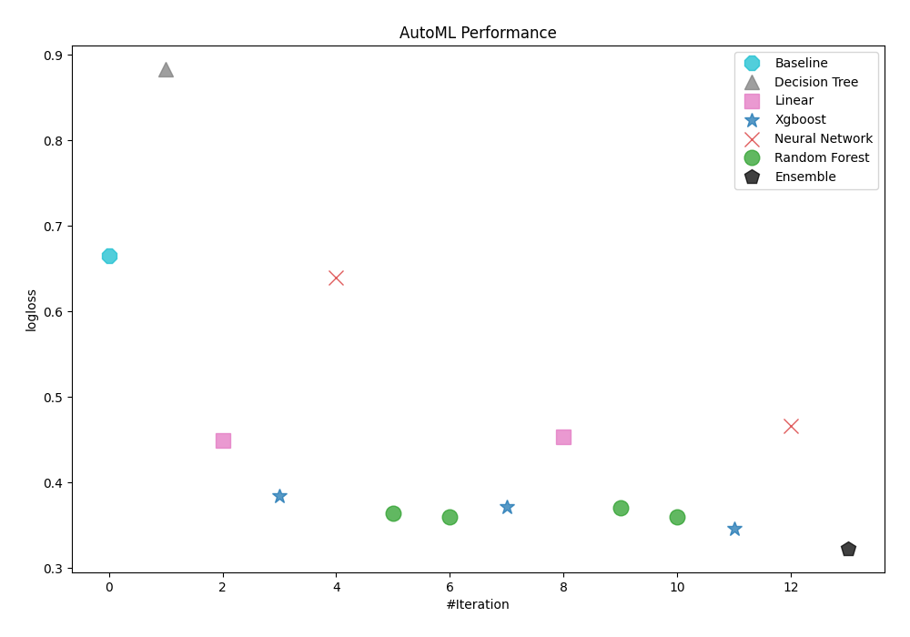
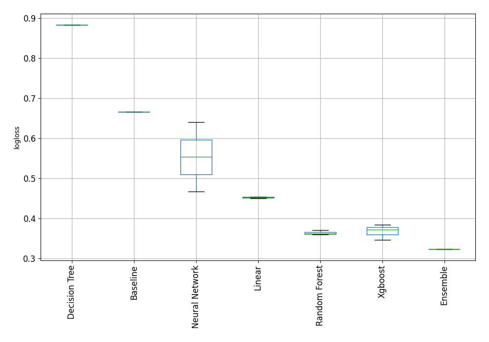

# Titanic - Machine Learning from Disaster

  

The sinking of the Titanic remains one of history's most notorious maritime disasters.

On April 15, 1912, during its maiden voyage, the "unsinkable" RMS Titanic struck an iceberg and sank. Tragically, due to insufficient lifeboats, 1,502 out of the 2,224 passengers and crew lost their lives.

Although luck played a role in survival, certain groups of people had higher chances of surviving than others.

This repository will try to answer: "Which types of people were more likely to survive?" using passenger data such as name, age, gender, socio-economic class, and more.

## Summary
This is a binary classification task on a small dataset. Without prior feature engineering one can get a test accuracy on 79.19% using AutoGloun ensamble of a linear regression model with an XGBoost. 

## Insights from data
The dataset contains 12 features including the target feature `Survived`.
The dataset contains 891 rows with 6 categorical, 3 numerical and 3 text features.
The dataset contains 866 Missing cells for the features: `Age`, `Cabin` and `Embarked`.

## Results of the different models

| Best model   | name                                                                                                                       | model_type     | metric_type   |   metric_value |   train_time |
|:-------------|:---------------------------------------------------------------------------------------------------------------------------|:---------------|:--------------|---------------:|-------------:|
|              | [1_Baseline](models/AutoML_1_explain/1_Baseline/README.md)                                                                                         | Baseline       | logloss       |       0.665558 |         0.22 |
|              | [2_DecisionTree](models/AutoML_1_explain/2_DecisionTree/README.md)                                                                                 | Decision Tree  | logloss       |       0.882843 |         8.17 |
|              | [3_Linear](models/AutoML_1_explain/3_Linear/README.md)                                                                                             | Linear         | logloss       |       0.449757 |         6.55 |
|              | [4_Default_Xgboost](models/AutoML_1_explain/4_Default_Xgboost/README.md)                                                                           | Xgboost        | logloss       |       0.383808 |         4    |
|              | [5_Default_NeuralNetwork](models/AutoML_1_explain/5_Default_NeuralNetwork/README.md)                                                               | Neural Network | logloss       |       0.639516 |         3.68 |
|              | [6_Default_RandomForest](models/AutoML_1_explain/6_Default_RandomForest/README.md)                                                                 | Random Forest  | logloss       |       0.364165 |         7.2  |
|              | [6_Default_RandomForest_GoldenFeatures](models/AutoML_1_explain/6_Default_RandomForest_GoldenFeatures/README.md)                                   | Random Forest  | logloss       |       0.359508 |         7.47 |
|              | [4_Default_Xgboost_GoldenFeatures](models/AutoML_1_explain/4_Default_Xgboost_GoldenFeatures/README.md)                                             | Xgboost        | logloss       |       0.371979 |         4.01 |
|              | [3_Linear_GoldenFeatures](models/AutoML_1_explain/3_Linear_GoldenFeatures/README.md)                                                               | Linear         | logloss       |       0.453837 |         7.91 |
|              | [6_Default_RandomForest_GoldenFeatures_RandomFeature](models/AutoML_1_explain/6_Default_RandomForest_GoldenFeatures_RandomFeature/README.md)       | Random Forest  | logloss       |       0.369989 |         7.24 |
|              | [6_Default_RandomForest_GoldenFeatures_SelectedFeatures](models/AutoML_1_explain/6_Default_RandomForest_GoldenFeatures_SelectedFeatures/README.md) | Random Forest  | logloss       |       0.360324 |         2.95 |
|              | [4_Default_Xgboost_GoldenFeatures_SelectedFeatures](models/AutoML_1_explain/4_Default_Xgboost_GoldenFeatures_SelectedFeatures/README.md)           | Xgboost        | logloss       |       0.346536 |         2.34 |
|              | [5_Default_NeuralNetwork_SelectedFeatures](models/AutoML_1_explain/5_Default_NeuralNetwork_SelectedFeatures/README.md)                             | Neural Network | logloss       |       0.466259 |         2.4  |
| **the best** | [Ensemble](models/AutoML_1_explain/Ensemble/README.md)                                                                                             | Ensemble       | logloss       |       0.323021 |         2.28 |

### Performance

### Model type Performance Boxplot
