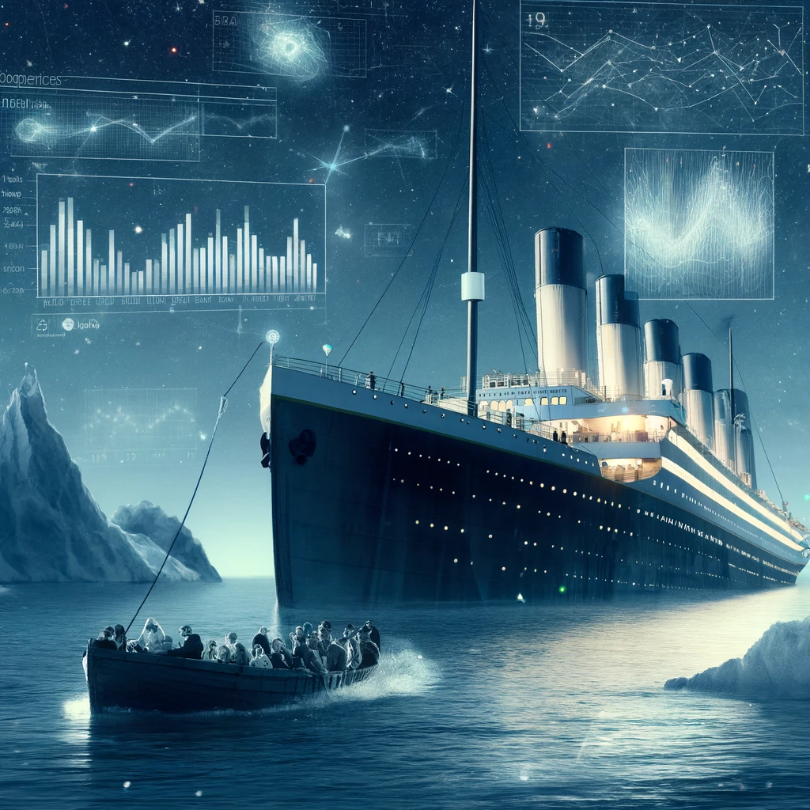

# Titanic - Machine Learning from Disaster

  

The sinking of the Titanic remains one of history's most notorious maritime disasters.

On April 15, 1912, during its maiden voyage, the "unsinkable" RMS Titanic struck an iceberg and sank. Tragically, due to insufficient lifeboats, 1,502 out of the 2,224 passengers and crew lost their lives.

Although luck played a role in survival, certain groups of people had higher chances of surviving than others.

This repository will try to answer: "Which types of people were more likely to survive?" using passenger data such as name, age, gender, socio-economic class, and more.

## Summary

## Insights of data

## Results of the different models
