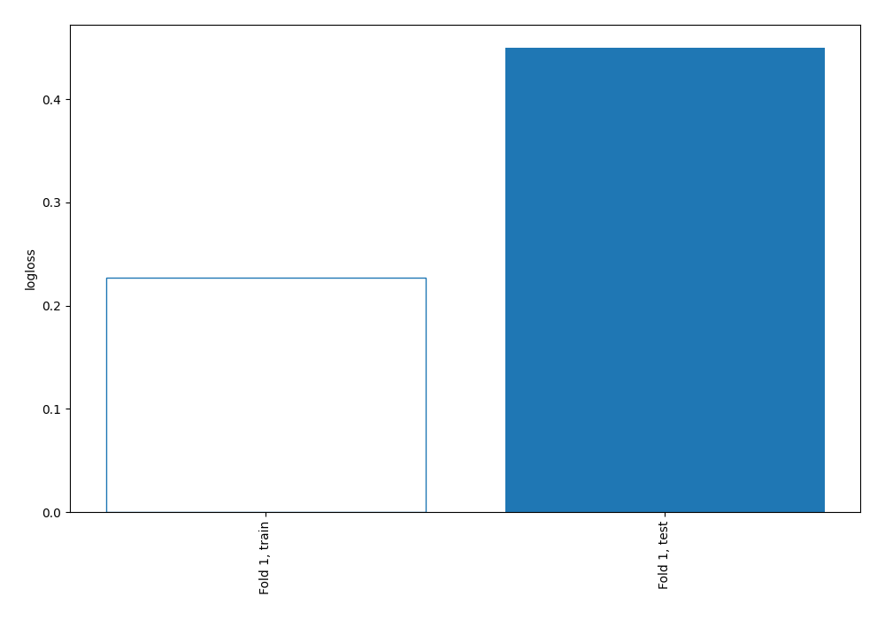
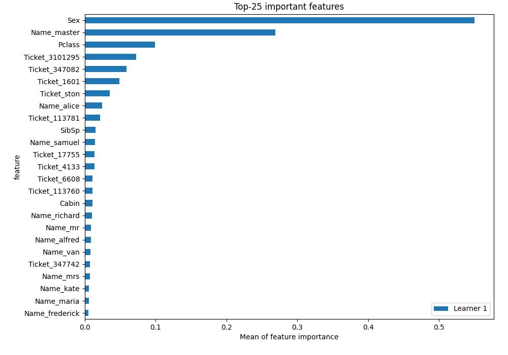
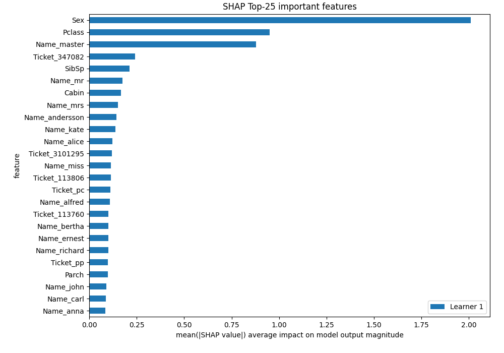
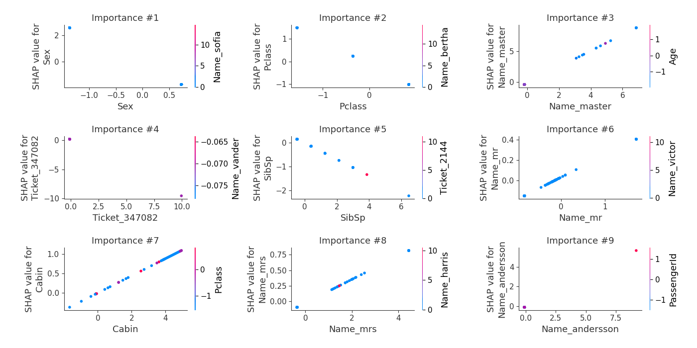
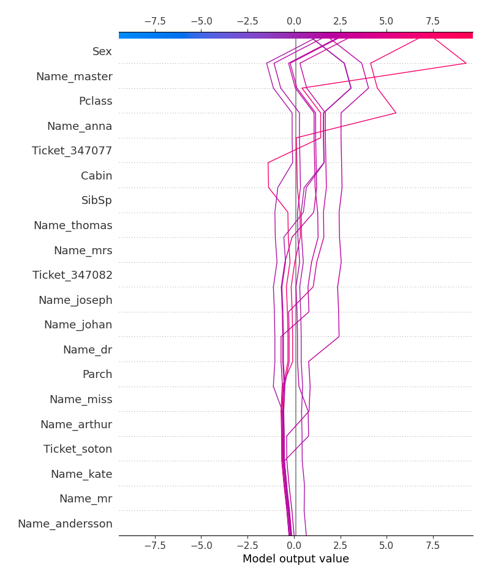
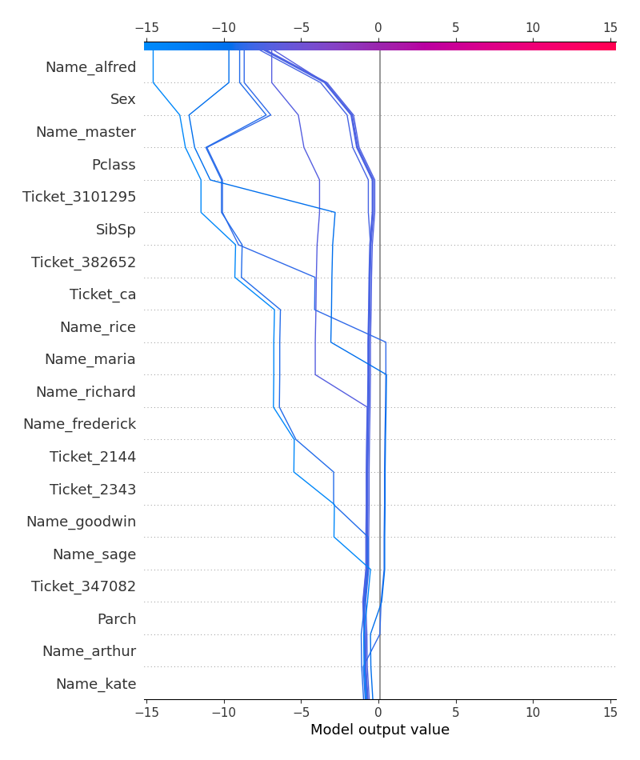
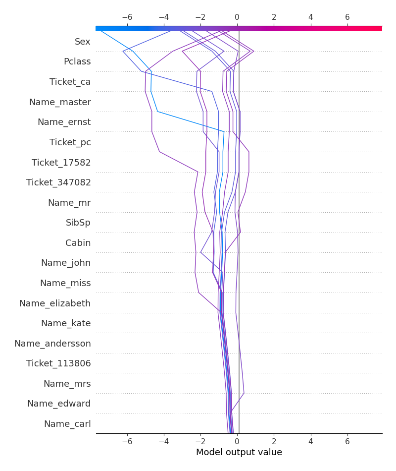
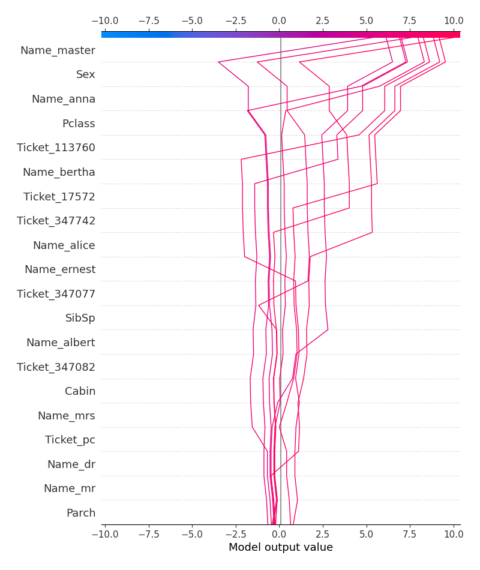

# Summary of 3_Linear

[<< Go back](../README.md)

## Logistic Regression (Linear)
- **n_jobs**: -1
- **explain_level**: 2

## Validation
 - **validation_type**: split
 - **train_ratio**: 0.75
 - **shuffle**: True
 - **stratify**: True

## Optimized metric
logloss

## Training time

6.1 seconds

## Metric details
|           |    score |     threshold |
|:----------|---------:|--------------:|
| logloss   | 0.449757 | nan           |
| auc       | 0.896313 | nan           |
| f1        | 0.8      |   0.530487    |
| accuracy  | 0.845771 |   0.530487    |
| precision | 1        |   0.999486    |
| recall    | 1        |   4.24896e-07 |
| mcc       | 0.67454  |   0.530487    |

## Metric details with threshold from accuracy metric
|           |    score |   threshold |
|:----------|---------:|------------:|
| logloss   | 0.449757 |  nan        |
| auc       | 0.896313 |  nan        |
| f1        | 0.8      |    0.530487 |
| accuracy  | 0.845771 |    0.530487 |
| precision | 0.794872 |    0.530487 |
| recall    | 0.805195 |    0.530487 |
| mcc       | 0.67454  |    0.530487 |

## Confusion matrix (at threshold=0.530487)
|              |   Predicted as 0 |   Predicted as 1 |
|:-------------|-----------------:|-----------------:|
| Labeled as 0 |              108 |               16 |
| Labeled as 1 |               15 |               62 |

## Learning curves

## Permutation-based Importance

## SHAP Importance

## SHAP Dependence plots

### Dependence (Fold 1)

## SHAP Decision plots

### Top-10 Worst decisions for class 0 (Fold 1)

### Top-10 Best decisions for class 0 (Fold 1)

### Top-10 Worst decisions for class 1 (Fold 1)

### Top-10 Best decisions for class 1 (Fold 1)

[<< Go back](../README.md)
