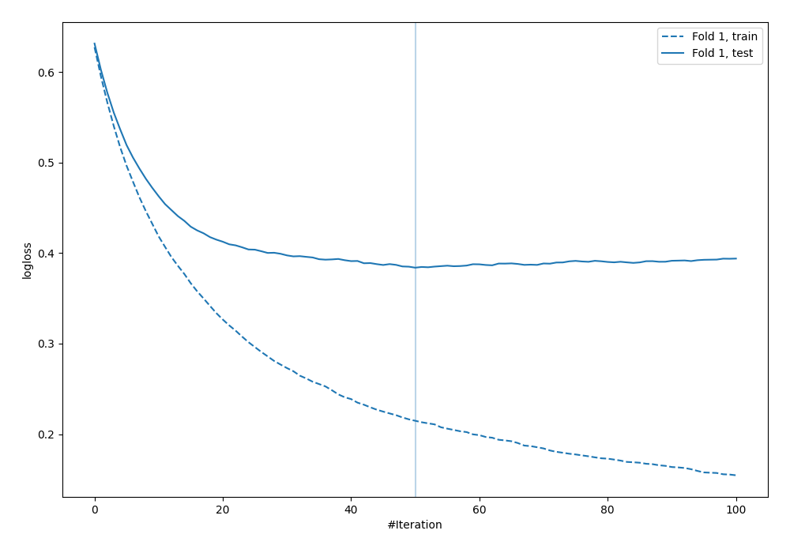
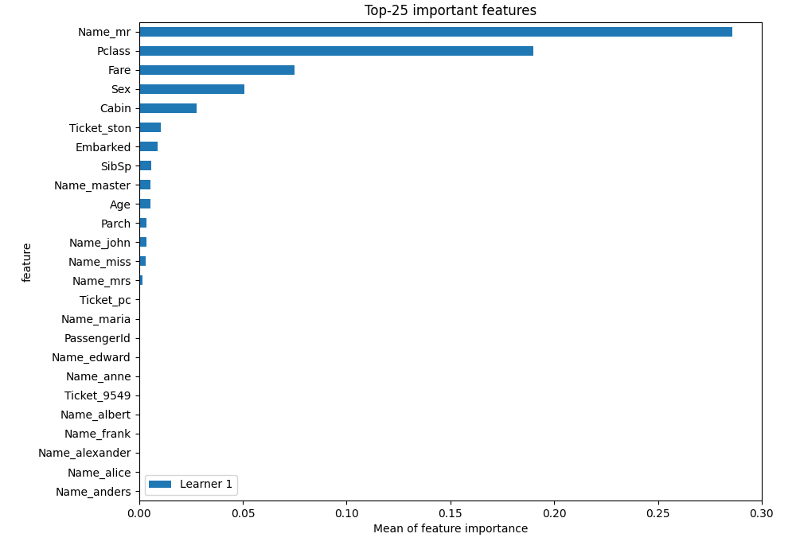

# Summary of 4_Default_Xgboost

[<< Go back](../README.md)

## Extreme Gradient Boosting (Xgboost)
- **n_jobs**: -1
- **objective**: binary:logistic
- **eta**: 0.075
- **max_depth**: 6
- **min_child_weight**: 1
- **subsample**: 1.0
- **colsample_bytree**: 1.0
- **eval_metric**: logloss
- **explain_level**: 2

## Validation
 - **validation_type**: split
 - **train_ratio**: 0.75
 - **shuffle**: True
 - **stratify**: True

## Optimized metric
logloss

## Training time

3.7 seconds

## Metric details
|           |    score |   threshold |
|:----------|---------:|------------:|
| logloss   | 0.383808 | nan         |
| auc       | 0.894533 | nan         |
| f1        | 0.812903 |   0.4257    |
| accuracy  | 0.855721 |   0.4257    |
| precision | 1        |   0.936902  |
| recall    | 1        |   0.0279553 |
| mcc       | 0.695541 |   0.4257    |

## Metric details with threshold from accuracy metric
|           |    score |   threshold |
|:----------|---------:|------------:|
| logloss   | 0.383808 |    nan      |
| auc       | 0.894533 |    nan      |
| f1        | 0.812903 |      0.4257 |
| accuracy  | 0.855721 |      0.4257 |
| precision | 0.807692 |      0.4257 |
| recall    | 0.818182 |      0.4257 |
| mcc       | 0.695541 |      0.4257 |

## Confusion matrix (at threshold=0.4257)
|              |   Predicted as 0 |   Predicted as 1 |
|:-------------|-----------------:|-----------------:|
| Labeled as 0 |              109 |               15 |
| Labeled as 1 |               14 |               63 |

## Learning curves

## Permutation-based Importance

[<< Go back](../README.md)
