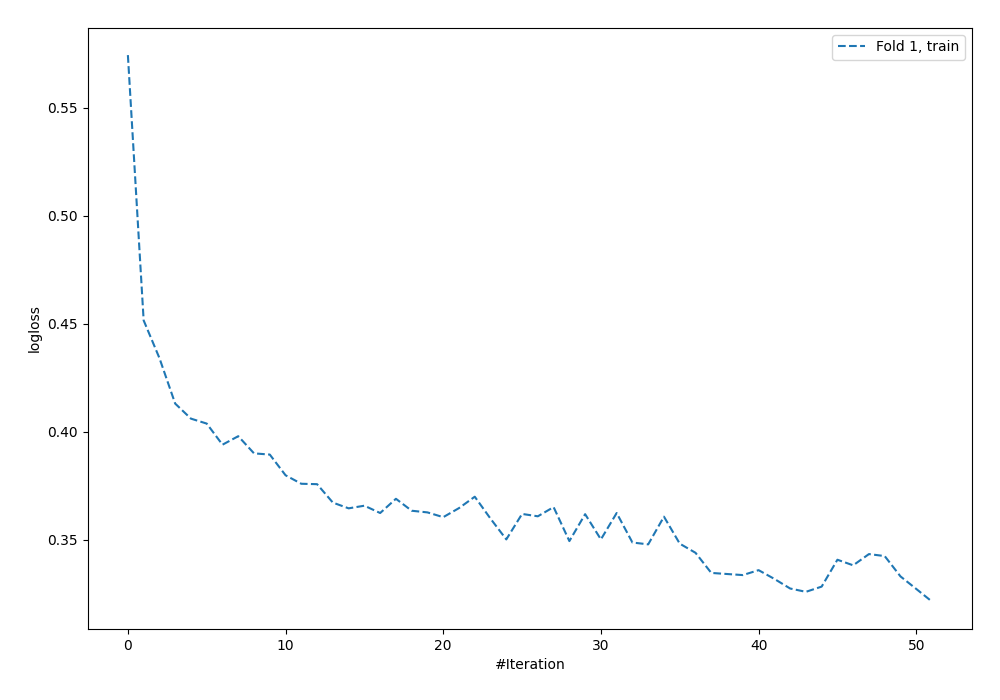
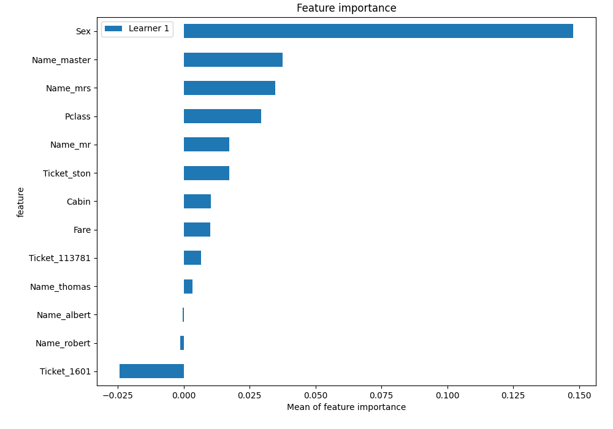

# Summary of 5_Default_NeuralNetwork_SelectedFeatures

[<< Go back](../README.md)

## Neural Network
- **n_jobs**: -1
- **dense_1_size**: 32
- **dense_2_size**: 16
- **learning_rate**: 0.05
- **explain_level**: 2

## Validation
 - **validation_type**: split
 - **train_ratio**: 0.75
 - **shuffle**: True
 - **stratify**: True

## Optimized metric
logloss

## Training time

2.2 seconds

## Metric details
|           |    score |   threshold |
|:----------|---------:|------------:|
| logloss   | 0.466259 | nan         |
| auc       | 0.844889 | nan         |
| f1        | 0.742857 |   0.458699  |
| accuracy  | 0.825871 |   0.853544  |
| precision | 1        |   0.895814  |
| recall    | 1        |   0.0211715 |
| mcc       | 0.647054 |   0.853544  |

## Metric details with threshold from accuracy metric
|           |    score |   threshold |
|:----------|---------:|------------:|
| logloss   | 0.466259 |  nan        |
| auc       | 0.844889 |  nan        |
| f1        | 0.710744 |    0.853544 |
| accuracy  | 0.825871 |    0.853544 |
| precision | 0.977273 |    0.853544 |
| recall    | 0.558442 |    0.853544 |
| mcc       | 0.647054 |    0.853544 |

## Confusion matrix (at threshold=0.853544)
|              |   Predicted as 0 |   Predicted as 1 |
|:-------------|-----------------:|-----------------:|
| Labeled as 0 |              123 |                1 |
| Labeled as 1 |               34 |               43 |

## Learning curves

## Permutation-based Importance

[<< Go back](../README.md)
