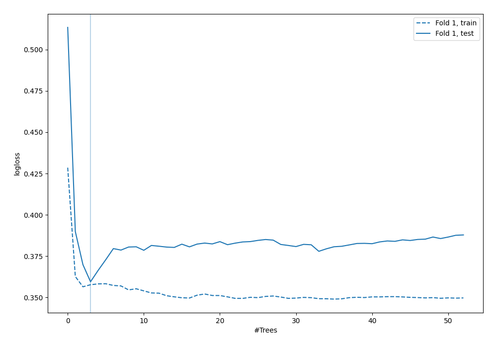
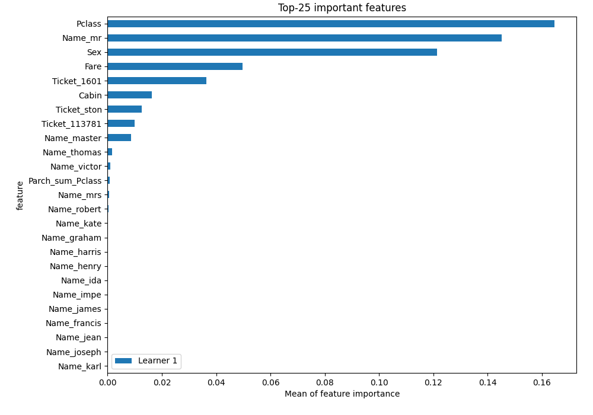

# Summary of 6_Default_RandomForest_GoldenFeatures

[<< Go back](../README.md)

## Random Forest
- **n_jobs**: -1
- **criterion**: gini
- **max_features**: 0.9
- **min_samples_split**: 30
- **max_depth**: 4
- **eval_metric_name**: logloss
- **explain_level**: 2

## Validation
 - **validation_type**: split
 - **train_ratio**: 0.75
 - **shuffle**: True
 - **stratify**: True

## Optimized metric
logloss

## Training time

7.2 seconds

## Metric details
|           |    score |   threshold |
|:----------|---------:|------------:|
| logloss   | 0.359508 | nan         |
| auc       | 0.907729 | nan         |
| f1        | 0.792899 |   0.394496  |
| accuracy  | 0.845771 |   0.539992  |
| precision | 1        |   0.752908  |
| recall    | 1        |   0.0933481 |
| mcc       | 0.669378 |   0.539992  |

## Metric details with threshold from accuracy metric
|           |    score |   threshold |
|:----------|---------:|------------:|
| logloss   | 0.359508 |  nan        |
| auc       | 0.907729 |  nan        |
| f1        | 0.783217 |    0.539992 |
| accuracy  | 0.845771 |    0.539992 |
| precision | 0.848485 |    0.539992 |
| recall    | 0.727273 |    0.539992 |
| mcc       | 0.669378 |    0.539992 |

## Confusion matrix (at threshold=0.539992)
|              |   Predicted as 0 |   Predicted as 1 |
|:-------------|-----------------:|-----------------:|
| Labeled as 0 |              114 |               10 |
| Labeled as 1 |               21 |               56 |

## Learning curves

## Permutation-based Importance

[<< Go back](../README.md)
