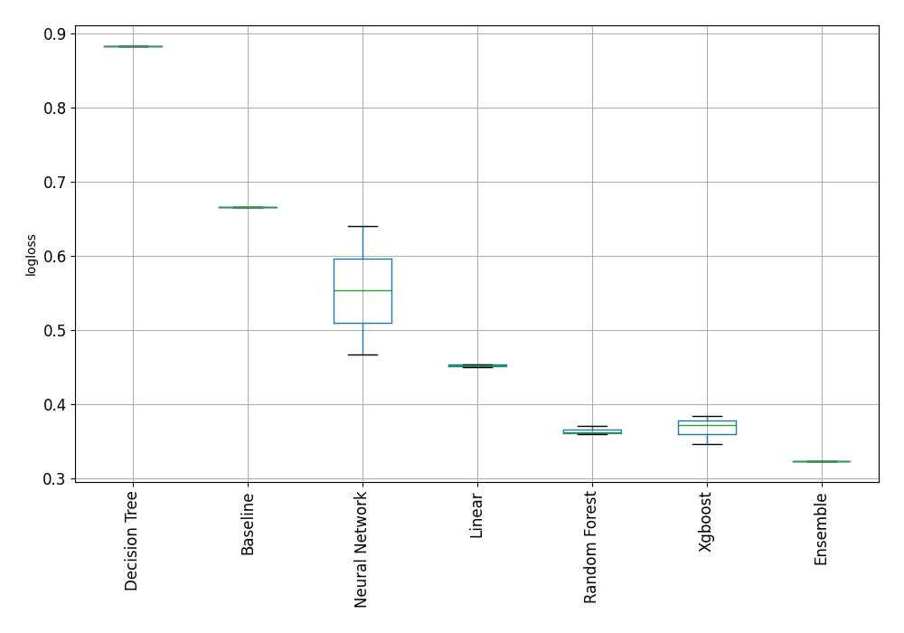

# AutoML Leaderboard

| Best model   | name                                                                                                                       | model_type     | metric_type   |   metric_value |   train_time |
|:-------------|:---------------------------------------------------------------------------------------------------------------------------|:---------------|:--------------|---------------:|-------------:|
|              | [1_Baseline](1_Baseline/README.md)                                                                                         | Baseline       | logloss       |       0.665558 |         0.22 |
|              | [2_DecisionTree](2_DecisionTree/README.md)                                                                                 | Decision Tree  | logloss       |       0.882843 |         8.17 |
|              | [3_Linear](3_Linear/README.md)                                                                                             | Linear         | logloss       |       0.449757 |         6.55 |
|              | [4_Default_Xgboost](4_Default_Xgboost/README.md)                                                                           | Xgboost        | logloss       |       0.383808 |         4    |
|              | [5_Default_NeuralNetwork](5_Default_NeuralNetwork/README.md)                                                               | Neural Network | logloss       |       0.639516 |         3.68 |
|              | [6_Default_RandomForest](6_Default_RandomForest/README.md)                                                                 | Random Forest  | logloss       |       0.364165 |         7.2  |
|              | [6_Default_RandomForest_GoldenFeatures](6_Default_RandomForest_GoldenFeatures/README.md)                                   | Random Forest  | logloss       |       0.359508 |         7.47 |
|              | [4_Default_Xgboost_GoldenFeatures](4_Default_Xgboost_GoldenFeatures/README.md)                                             | Xgboost        | logloss       |       0.371979 |         4.01 |
|              | [3_Linear_GoldenFeatures](3_Linear_GoldenFeatures/README.md)                                                               | Linear         | logloss       |       0.453837 |         7.91 |
|              | [6_Default_RandomForest_GoldenFeatures_RandomFeature](6_Default_RandomForest_GoldenFeatures_RandomFeature/README.md)       | Random Forest  | logloss       |       0.369989 |         7.24 |
|              | [6_Default_RandomForest_GoldenFeatures_SelectedFeatures](6_Default_RandomForest_GoldenFeatures_SelectedFeatures/README.md) | Random Forest  | logloss       |       0.360324 |         2.95 |
|              | [4_Default_Xgboost_GoldenFeatures_SelectedFeatures](4_Default_Xgboost_GoldenFeatures_SelectedFeatures/README.md)           | Xgboost        | logloss       |       0.346536 |         2.34 |
|              | [5_Default_NeuralNetwork_SelectedFeatures](5_Default_NeuralNetwork_SelectedFeatures/README.md)                             | Neural Network | logloss       |       0.466259 |         2.4  |
| **the best** | [Ensemble](Ensemble/README.md)                                                                                             | Ensemble       | logloss       |       0.323021 |         2.28 |

### AutoML Performance

### AutoML Performance Boxplot
