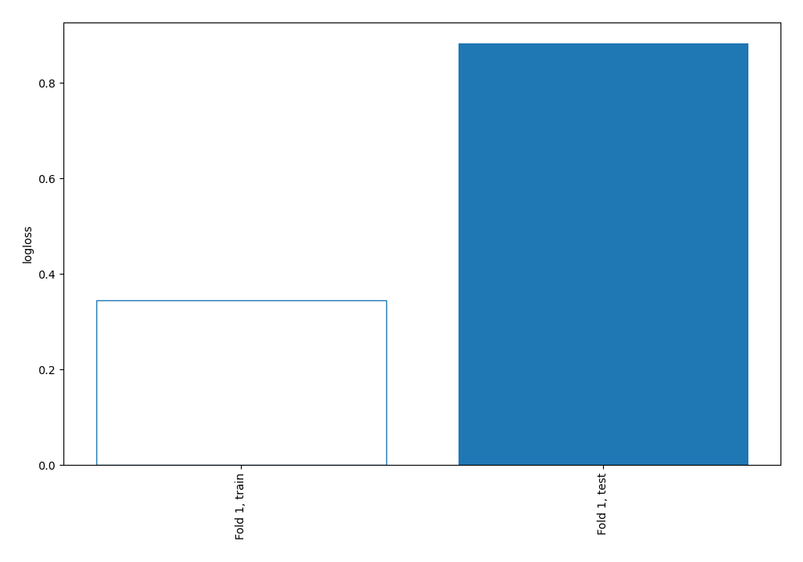
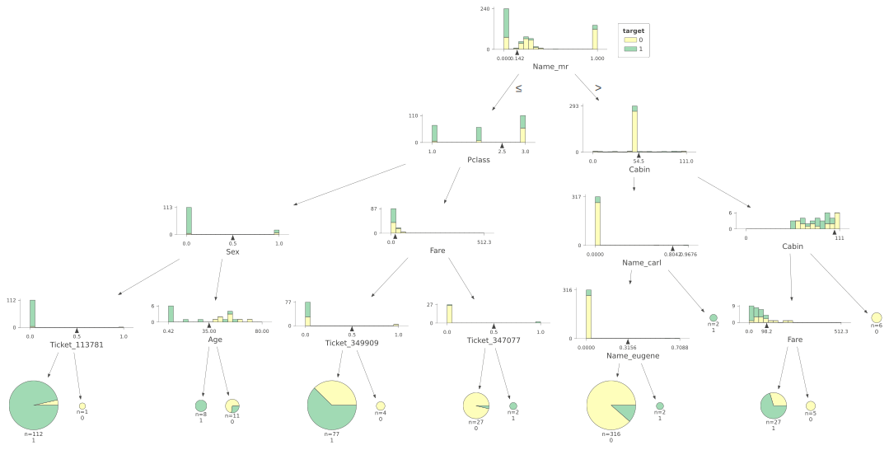
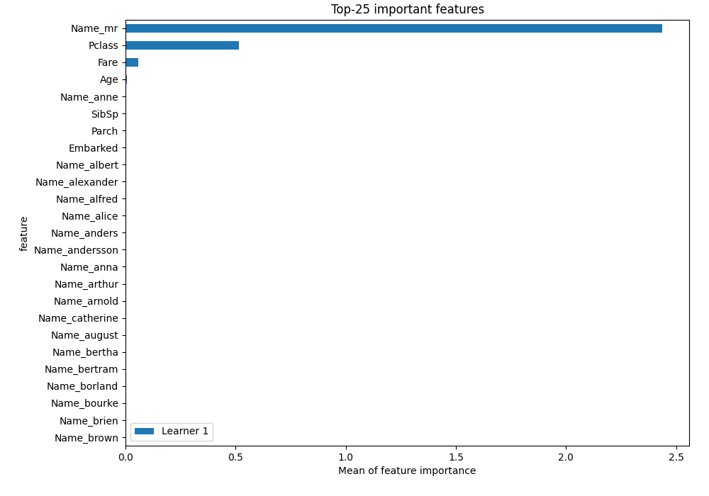

# Summary of 2_DecisionTree

[<< Go back](../README.md)

## Decision Tree
- **n_jobs**: -1
- **criterion**: entropy
- **max_depth**: 4
- **explain_level**: 2

## Validation
 - **validation_type**: split
 - **train_ratio**: 0.75
 - **shuffle**: True
 - **stratify**: True

## Optimized metric
logloss

## Training time

7.9 seconds

## Metric details
|           |    score |   threshold |
|:----------|---------:|------------:|
| logloss   | 0.882843 |  nan        |
| auc       | 0.830959 |  nan        |
| f1        | 0.77707  |    0.113924 |
| accuracy  | 0.825871 |    0.113924 |
| precision | 0.909091 |    0.703704 |
| recall    | 0.961039 |    0        |
| mcc       | 0.63461  |    0.113924 |

## Metric details with threshold from accuracy metric
|           |    score |   threshold |
|:----------|---------:|------------:|
| logloss   | 0.882843 |  nan        |
| auc       | 0.830959 |  nan        |
| f1        | 0.77707  |    0.113924 |
| accuracy  | 0.825871 |    0.113924 |
| precision | 0.7625   |    0.113924 |
| recall    | 0.792208 |    0.113924 |
| mcc       | 0.63461  |    0.113924 |

## Confusion matrix (at threshold=0.113924)
|              |   Predicted as 0 |   Predicted as 1 |
|:-------------|-----------------:|-----------------:|
| Labeled as 0 |              105 |               19 |
| Labeled as 1 |               16 |               61 |

## Learning curves

## Decision Tree 

### Tree #1

### Rules

if (Name_mr > 0.142) and (Cabin <= 54.5) and (Name_carl <= 0.804) and (Name_eugene <= 0.316) then class: 0 (proba: 88.61%) | based on 316 samples

if (Name_mr <= 0.142) and (Pclass <= 2.5) and (Sex <= 0.5) and (Ticket_113781 <= 0.5) then class: 1 (proba: 96.43%) | based on 112 samples

if (Name_mr <= 0.142) and (Pclass > 2.5) and (Fare <= 22.904) and (Ticket_349909 <= 0.5) then class: 1 (proba: 62.34%) | based on 77 samples

if (Name_mr > 0.142) and (Cabin > 54.5) and (Cabin <= 105.0) and (Fare <= 98.213) then class: 1 (proba: 70.37%) | based on 27 samples

if (Name_mr <= 0.142) and (Pclass > 2.5) and (Fare > 22.904) and (Ticket_347077 <= 0.5) then class: 0 (proba: 96.3%) | based on 27 samples

if (Name_mr <= 0.142) and (Pclass <= 2.5) and (Sex > 0.5) and (Age > 35.0) then class: 0 (proba: 72.73%) | based on 11 samples

if (Name_mr <= 0.142) and (Pclass <= 2.5) and (Sex > 0.5) and (Age <= 35.0) then class: 1 (proba: 100.0%) | based on 8 samples

if (Name_mr > 0.142) and (Cabin > 54.5) and (Cabin > 105.0) then class: 0 (proba: 100.0%) | based on 6 samples

if (Name_mr > 0.142) and (Cabin > 54.5) and (Cabin <= 105.0) and (Fare > 98.213) then class: 0 (proba: 100.0%) | based on 5 samples

if (Name_mr <= 0.142) and (Pclass > 2.5) and (Fare <= 22.904) and (Ticket_349909 > 0.5) then class: 0 (proba: 100.0%) | based on 4 samples

if (Name_mr > 0.142) and (Cabin <= 54.5) and (Name_carl > 0.804) then class: 1 (proba: 100.0%) | based on 2 samples

if (Name_mr > 0.142) and (Cabin <= 54.5) and (Name_carl <= 0.804) and (Name_eugene > 0.316) then class: 1 (proba: 100.0%) | based on 2 samples

if (Name_mr <= 0.142) and (Pclass > 2.5) and (Fare > 22.904) and (Ticket_347077 > 0.5) then class: 1 (proba: 100.0%) | based on 2 samples

if (Name_mr <= 0.142) and (Pclass <= 2.5) and (Sex <= 0.5) and (Ticket_113781 > 0.5) then class: 0 (proba: 100.0%) | based on 1 samples

## Permutation-based Importance

[<< Go back](../README.md)
