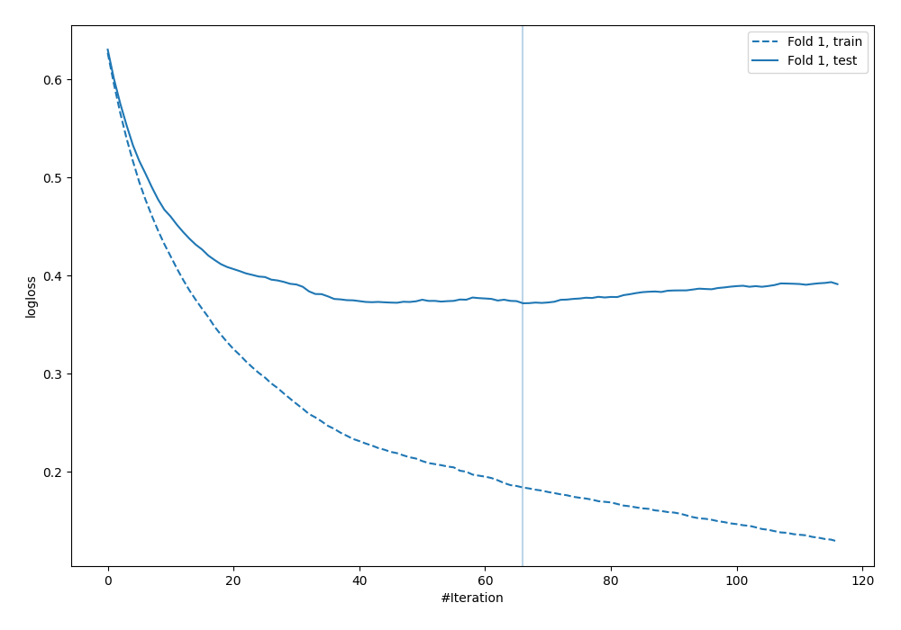
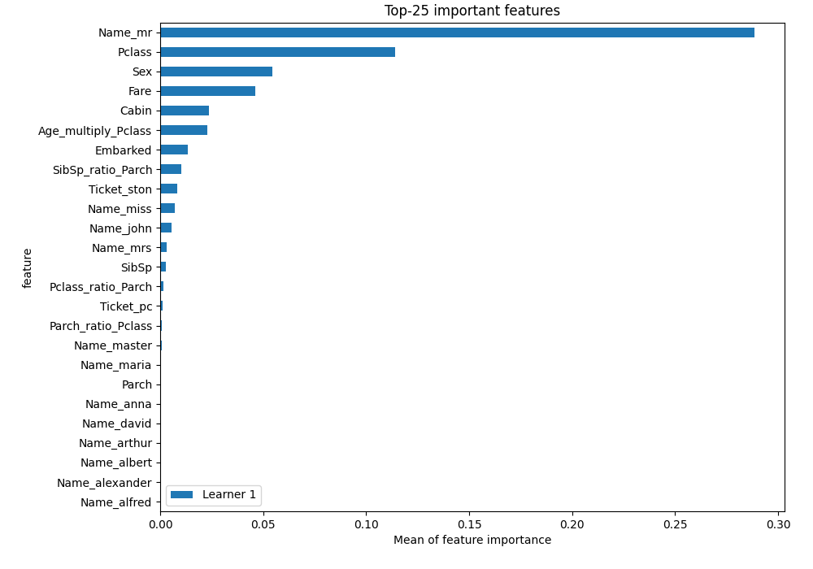

# Summary of 4_Default_Xgboost_GoldenFeatures

[<< Go back](../README.md)

## Extreme Gradient Boosting (Xgboost)
- **n_jobs**: -1
- **objective**: binary:logistic
- **eta**: 0.075
- **max_depth**: 6
- **min_child_weight**: 1
- **subsample**: 1.0
- **colsample_bytree**: 1.0
- **eval_metric**: logloss
- **explain_level**: 2

## Validation
 - **validation_type**: split
 - **train_ratio**: 0.75
 - **shuffle**: True
 - **stratify**: True

## Optimized metric
logloss

## Training time

3.7 seconds

## Metric details
|           |    score |   threshold |
|:----------|---------:|------------:|
| logloss   | 0.371979 | nan         |
| auc       | 0.909615 | nan         |
| f1        | 0.795322 |   0.266373  |
| accuracy  | 0.845771 |   0.533118  |
| precision | 1        |   0.966377  |
| recall    | 1        |   0.0209804 |
| mcc       | 0.671262 |   0.738872  |

## Metric details with threshold from accuracy metric
|           |    score |   threshold |
|:----------|---------:|------------:|
| logloss   | 0.371979 |  nan        |
| auc       | 0.909615 |  nan        |
| f1        | 0.791946 |    0.533118 |
| accuracy  | 0.845771 |    0.533118 |
| precision | 0.819444 |    0.533118 |
| recall    | 0.766234 |    0.533118 |
| mcc       | 0.670588 |    0.533118 |

## Confusion matrix (at threshold=0.533118)
|              |   Predicted as 0 |   Predicted as 1 |
|:-------------|-----------------:|-----------------:|
| Labeled as 0 |              111 |               13 |
| Labeled as 1 |               18 |               59 |

## Learning curves

## Permutation-based Importance

[<< Go back](../README.md)
