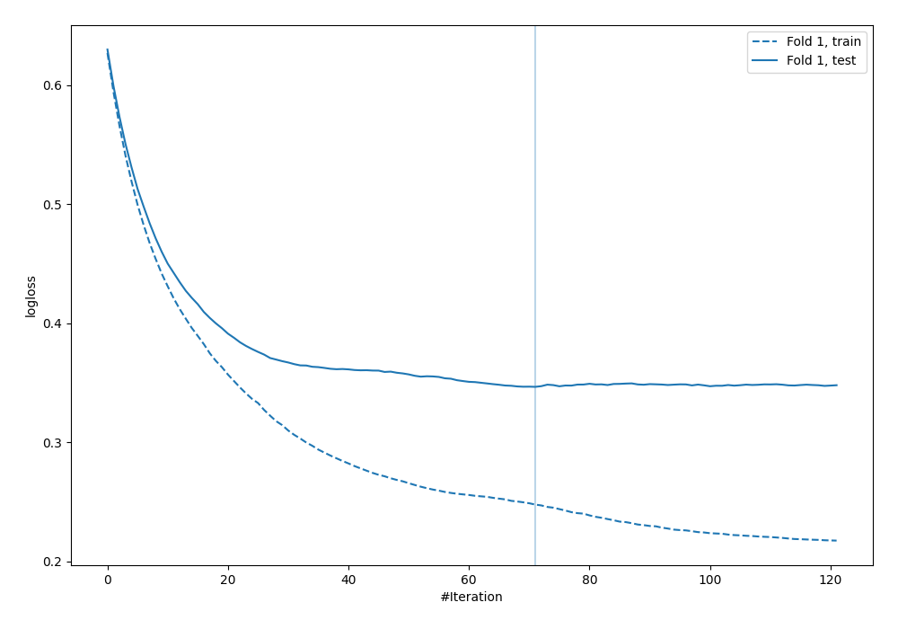
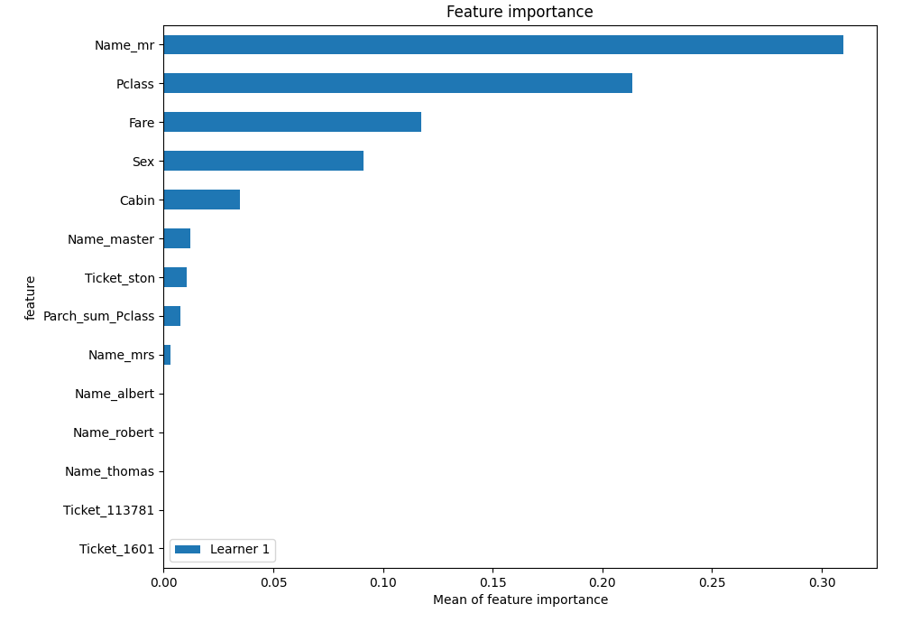

# Summary of 4_Default_Xgboost_GoldenFeatures_SelectedFeatures

[<< Go back](../README.md)

## Extreme Gradient Boosting (Xgboost)
- **n_jobs**: -1
- **objective**: binary:logistic
- **eta**: 0.075
- **max_depth**: 6
- **min_child_weight**: 1
- **subsample**: 1.0
- **colsample_bytree**: 1.0
- **eval_metric**: logloss
- **explain_level**: 2

## Validation
 - **validation_type**: split
 - **train_ratio**: 0.75
 - **shuffle**: True
 - **stratify**: True

## Optimized metric
logloss

## Training time

2.1 seconds

## Metric details
|           |    score |   threshold |
|:----------|---------:|------------:|
| logloss   | 0.346536 | nan         |
| auc       | 0.913228 | nan         |
| f1        | 0.813333 |   0.433929  |
| accuracy  | 0.860697 |   0.433929  |
| precision | 1        |   0.944459  |
| recall    | 1        |   0.0198182 |
| mcc       | 0.702984 |   0.433929  |

## Metric details with threshold from accuracy metric
|           |    score |   threshold |
|:----------|---------:|------------:|
| logloss   | 0.346536 |  nan        |
| auc       | 0.913228 |  nan        |
| f1        | 0.813333 |    0.433929 |
| accuracy  | 0.860697 |    0.433929 |
| precision | 0.835616 |    0.433929 |
| recall    | 0.792208 |    0.433929 |
| mcc       | 0.702984 |    0.433929 |

## Confusion matrix (at threshold=0.433929)
|              |   Predicted as 0 |   Predicted as 1 |
|:-------------|-----------------:|-----------------:|
| Labeled as 0 |              112 |               12 |
| Labeled as 1 |               16 |               61 |

## Learning curves

## Permutation-based Importance

[<< Go back](../README.md)
