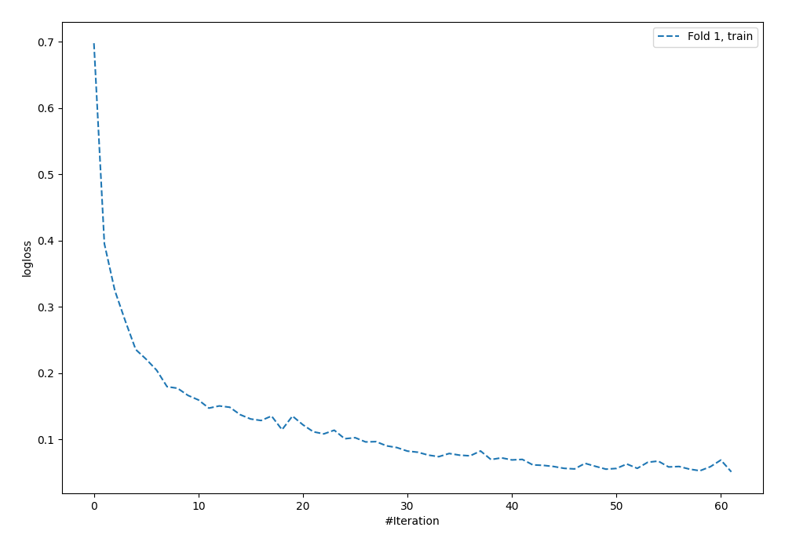
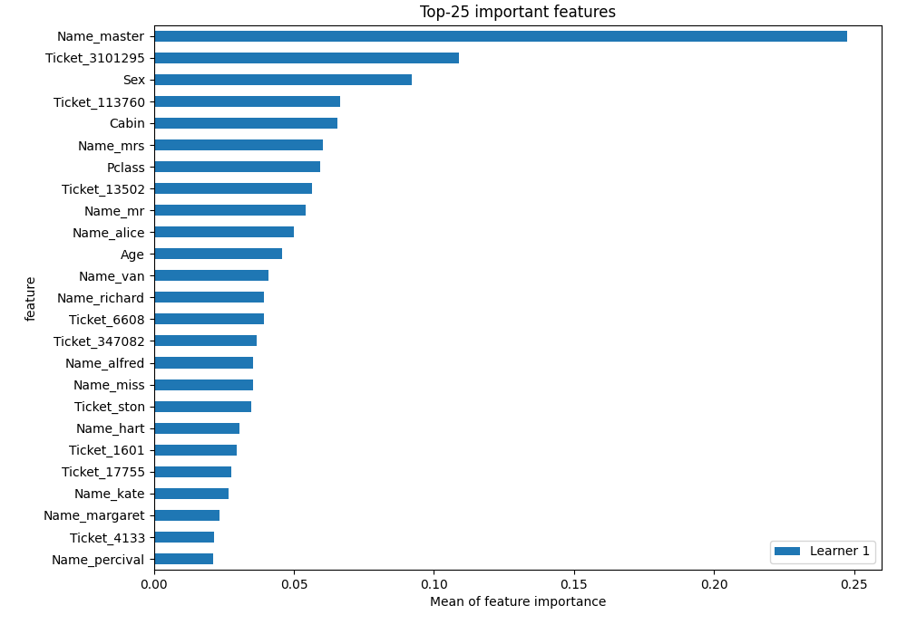

# Summary of 5_Default_NeuralNetwork

[<< Go back](../README.md)

## Neural Network
- **n_jobs**: -1
- **dense_1_size**: 32
- **dense_2_size**: 16
- **learning_rate**: 0.05
- **explain_level**: 2

## Validation
 - **validation_type**: split
 - **train_ratio**: 0.75
 - **shuffle**: True
 - **stratify**: True

## Optimized metric
logloss

## Training time

3.4 seconds

## Metric details
|           |    score |     threshold |
|:----------|---------:|--------------:|
| logloss   | 0.639516 | nan           |
| auc       | 0.869711 | nan           |
| f1        | 0.75817  |   0.46244     |
| accuracy  | 0.81592  |   0.46244     |
| precision | 0.916667 |   0.998016    |
| recall    | 1        |   4.60045e-12 |
| mcc       | 0.60962  |   0.46244     |

## Metric details with threshold from accuracy metric
|           |    score |   threshold |
|:----------|---------:|------------:|
| logloss   | 0.639516 |   nan       |
| auc       | 0.869711 |   nan       |
| f1        | 0.75817  |     0.46244 |
| accuracy  | 0.81592  |     0.46244 |
| precision | 0.763158 |     0.46244 |
| recall    | 0.753247 |     0.46244 |
| mcc       | 0.60962  |     0.46244 |

## Confusion matrix (at threshold=0.46244)
|              |   Predicted as 0 |   Predicted as 1 |
|:-------------|-----------------:|-----------------:|
| Labeled as 0 |              106 |               18 |
| Labeled as 1 |               19 |               58 |

## Learning curves

## Permutation-based Importance

[<< Go back](../README.md)
