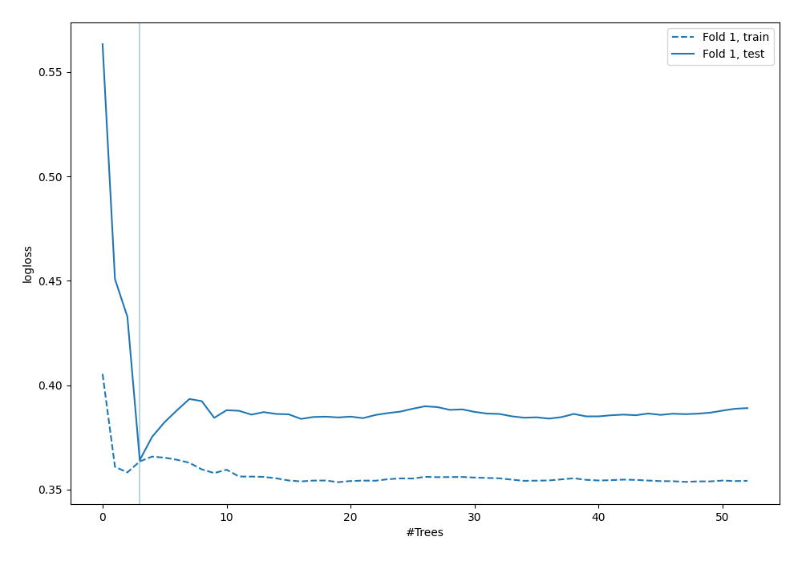
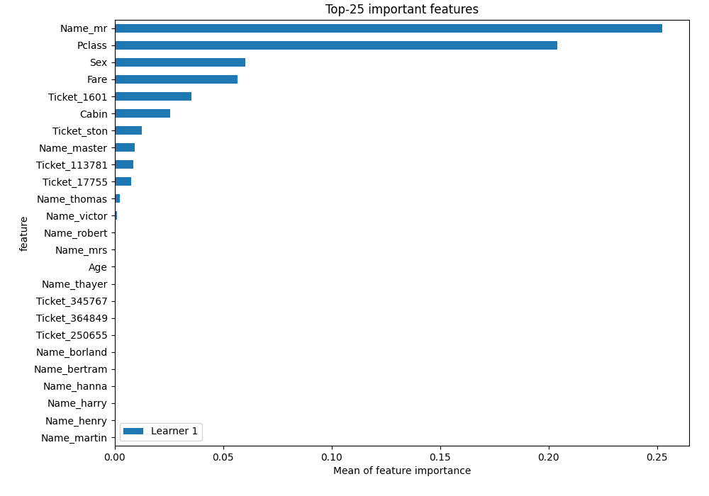

# Summary of 6_Default_RandomForest

[<< Go back](../README.md)

## Random Forest
- **n_jobs**: -1
- **criterion**: gini
- **max_features**: 0.9
- **min_samples_split**: 30
- **max_depth**: 4
- **eval_metric_name**: logloss
- **explain_level**: 2

## Validation
 - **validation_type**: split
 - **train_ratio**: 0.75
 - **shuffle**: True
 - **stratify**: True

## Optimized metric
logloss

## Training time

6.9 seconds

## Metric details
|           |    score |   threshold |
|:----------|---------:|------------:|
| logloss   | 0.364165 | nan         |
| auc       | 0.906944 | nan         |
| f1        | 0.797386 |   0.514143  |
| accuracy  | 0.845771 |   0.514143  |
| precision | 1        |   0.749575  |
| recall    | 1        |   0.0962533 |
| mcc       | 0.672934 |   0.514143  |

## Metric details with threshold from accuracy metric
|           |    score |   threshold |
|:----------|---------:|------------:|
| logloss   | 0.364165 |  nan        |
| auc       | 0.906944 |  nan        |
| f1        | 0.797386 |    0.514143 |
| accuracy  | 0.845771 |    0.514143 |
| precision | 0.802632 |    0.514143 |
| recall    | 0.792208 |    0.514143 |
| mcc       | 0.672934 |    0.514143 |

## Confusion matrix (at threshold=0.514143)
|              |   Predicted as 0 |   Predicted as 1 |
|:-------------|-----------------:|-----------------:|
| Labeled as 0 |              109 |               15 |
| Labeled as 1 |               16 |               61 |

## Learning curves

## Permutation-based Importance

[<< Go back](../README.md)
