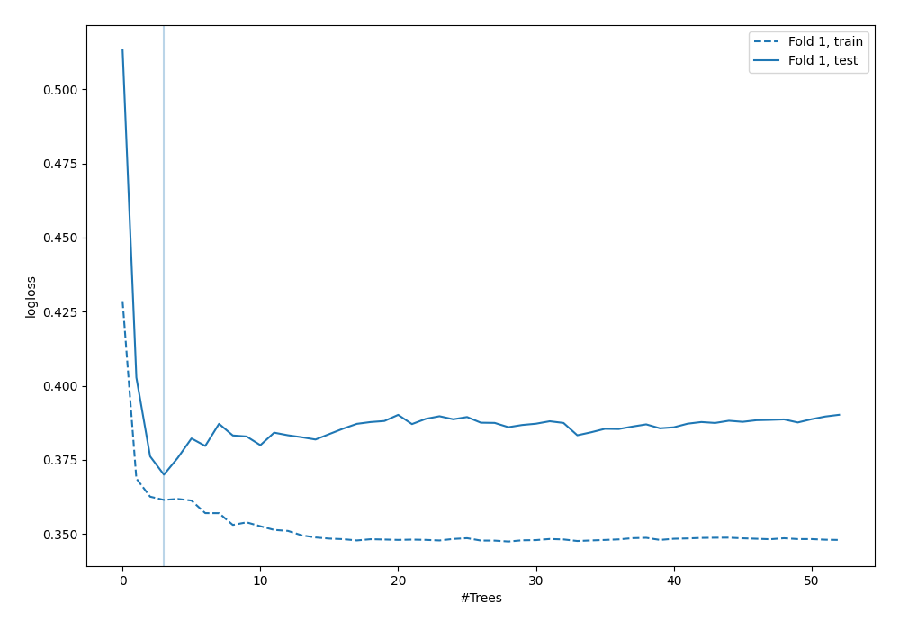
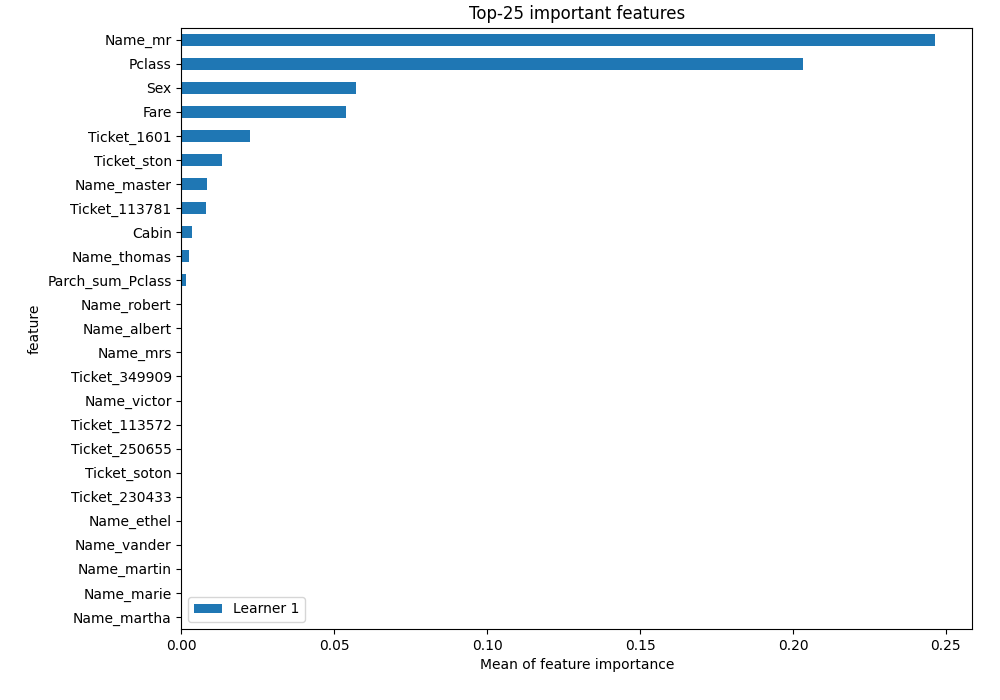

# Summary of 6_Default_RandomForest_GoldenFeatures_RandomFeature

[<< Go back](../README.md)

## Random Forest
- **n_jobs**: -1
- **criterion**: gini
- **max_features**: 0.9
- **min_samples_split**: 30
- **max_depth**: 4
- **eval_metric_name**: logloss
- **explain_level**: 1

## Validation
 - **validation_type**: split
 - **train_ratio**: 0.75
 - **shuffle**: True
 - **stratify**: True

## Optimized metric
logloss

## Training time

7.0 seconds

## Metric details
|           |    score |   threshold |
|:----------|---------:|------------:|
| logloss   | 0.369989 | nan         |
| auc       | 0.896889 | nan         |
| f1        | 0.788571 |   0.336277  |
| accuracy  | 0.825871 |   0.458173  |
| precision | 1        |   0.748294  |
| recall    | 1        |   0.0872003 |
| mcc       | 0.644073 |   0.336277  |

## Metric details with threshold from accuracy metric
|           |    score |   threshold |
|:----------|---------:|------------:|
| logloss   | 0.369989 |  nan        |
| auc       | 0.896889 |  nan        |
| f1        | 0.782609 |    0.458173 |
| accuracy  | 0.825871 |    0.458173 |
| precision | 0.75     |    0.458173 |
| recall    | 0.818182 |    0.458173 |
| mcc       | 0.639518 |    0.458173 |

## Confusion matrix (at threshold=0.458173)
|              |   Predicted as 0 |   Predicted as 1 |
|:-------------|-----------------:|-----------------:|
| Labeled as 0 |              103 |               21 |
| Labeled as 1 |               14 |               63 |

## Learning curves

## Permutation-based Importance

[<< Go back](../README.md)
