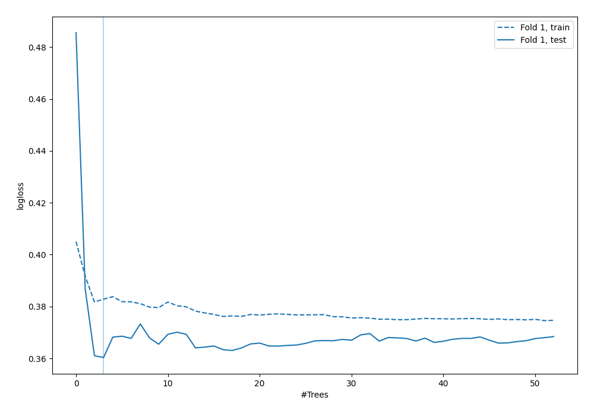
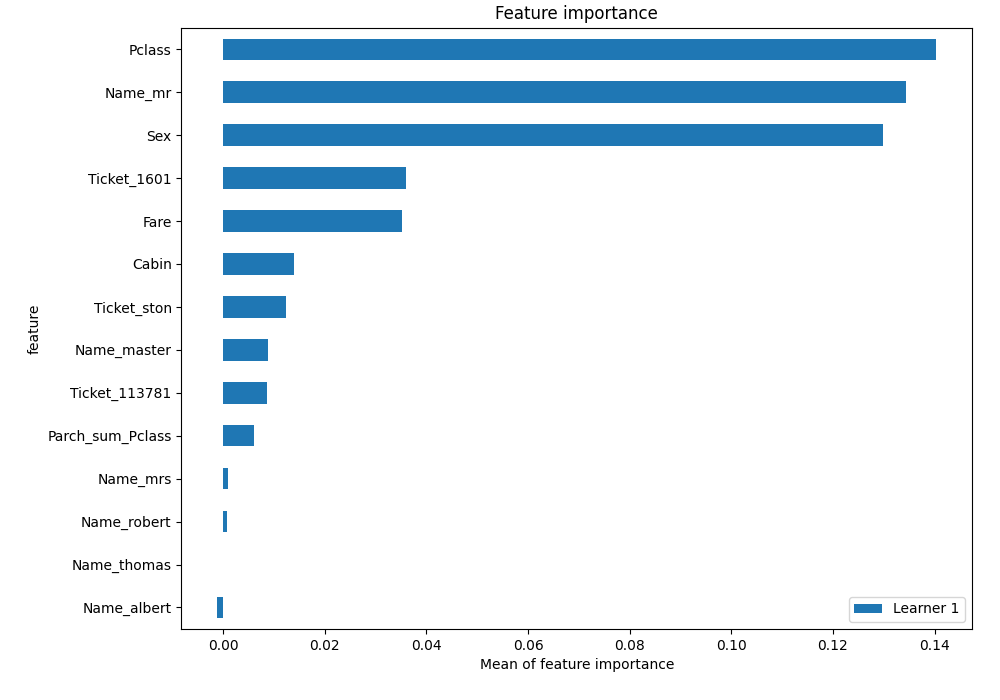

# Summary of 6_Default_RandomForest_GoldenFeatures_SelectedFeatures

[<< Go back](../README.md)

## Random Forest
- **n_jobs**: -1
- **criterion**: gini
- **max_features**: 0.9
- **min_samples_split**: 30
- **max_depth**: 4
- **eval_metric_name**: logloss
- **explain_level**: 2

## Validation
 - **validation_type**: split
 - **train_ratio**: 0.75
 - **shuffle**: True
 - **stratify**: True

## Optimized metric
logloss

## Training time

2.7 seconds

## Metric details
|           |    score |   threshold |
|:----------|---------:|------------:|
| logloss   | 0.360324 | nan         |
| auc       | 0.912128 | nan         |
| f1        | 0.804598 |   0.343206  |
| accuracy  | 0.845771 |   0.603798  |
| precision | 1        |   0.631474  |
| recall    | 1        |   0.0971584 |
| mcc       | 0.679569 |   0.603798  |

## Metric details with threshold from accuracy metric
|           |    score |   threshold |
|:----------|---------:|------------:|
| logloss   | 0.360324 |  nan        |
| auc       | 0.912128 |  nan        |
| f1        | 0.75969  |    0.603798 |
| accuracy  | 0.845771 |    0.603798 |
| precision | 0.942308 |    0.603798 |
| recall    | 0.636364 |    0.603798 |
| mcc       | 0.679569 |    0.603798 |

## Confusion matrix (at threshold=0.603798)
|              |   Predicted as 0 |   Predicted as 1 |
|:-------------|-----------------:|-----------------:|
| Labeled as 0 |              121 |                3 |
| Labeled as 1 |               28 |               49 |

## Learning curves

## Permutation-based Importance

[<< Go back](../README.md)
