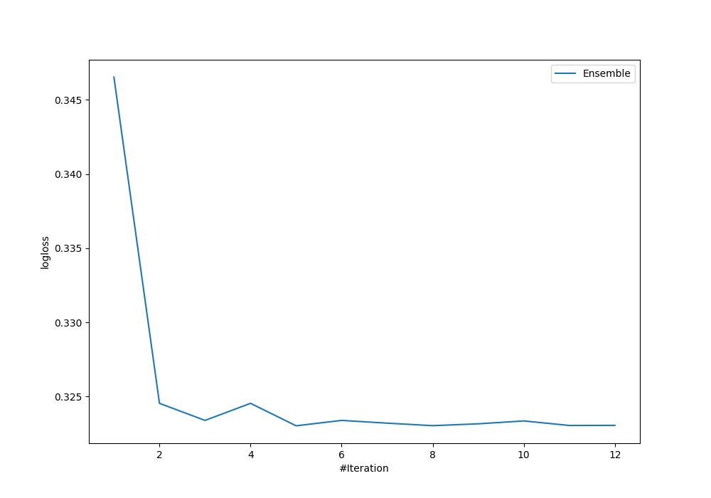

# Summary of Ensemble

[<< Go back](../README.md)

## Ensemble structure
| Model                                             |   Weight |
|:--------------------------------------------------|---------:|
| 3_Linear                                          |        2 |
| 4_Default_Xgboost_GoldenFeatures_SelectedFeatures |        3 |

## Metric details
|           |    score |   threshold |
|:----------|---------:|------------:|
| logloss   | 0.323021 | nan         |
| auc       | 0.925953 | nan         |
| f1        | 0.818792 |   0.548465  |
| accuracy  | 0.865672 |   0.548465  |
| precision | 1        |   0.777156  |
| recall    | 1        |   0.0161746 |
| mcc       | 0.713277 |   0.548465  |

## Metric details with threshold from accuracy metric
|           |    score |   threshold |
|:----------|---------:|------------:|
| logloss   | 0.323021 |  nan        |
| auc       | 0.925953 |  nan        |
| f1        | 0.818792 |    0.548465 |
| accuracy  | 0.865672 |    0.548465 |
| precision | 0.847222 |    0.548465 |
| recall    | 0.792208 |    0.548465 |
| mcc       | 0.713277 |    0.548465 |

## Confusion matrix (at threshold=0.548465)
|              |   Predicted as 0 |   Predicted as 1 |
|:-------------|-----------------:|-----------------:|
| Labeled as 0 |              113 |               11 |
| Labeled as 1 |               16 |               61 |

## Learning curves

[<< Go back](../README.md)
